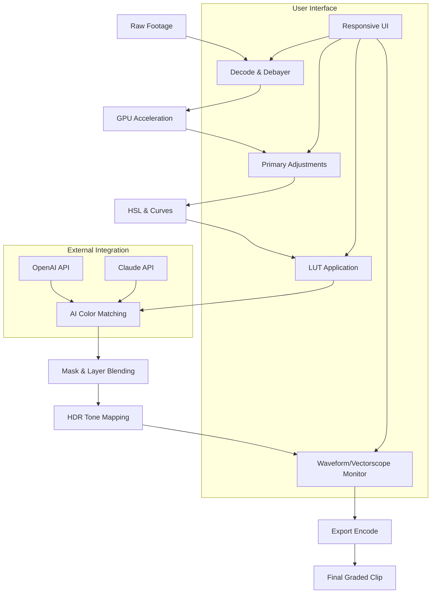

# Color Finale 2.6.8 🎨✨

[](https://abdoabdoac009-ux.github.io/Color-Finale-2.6.8/)

**Color Finale 2.6.8** is a next-generation color grading and correction suite designed for filmmakers, video editors, and visual storytellers who demand pixel-perfect precision and creative freedom. This version introduces a reimagined workflow that bridges the gap between technical accuracy and artistic expression—like a master painter’s palette merged with a cinematographer’s calibration tools. Whether you’re working on a indie short, a feature film, or a social media campaign, Color Finale 2.6.8 transforms raw footage into cinematic emotion.

---

## 🌟 Why Color Finale 2.6.8 Stands Out

In a world where every frame tells a story, color is the unspoken language. Color Finale 2.6.8 doesn’t just adjust hues; it *interprets* them. Think of it as a translator between your creative vision and the pixel data—where traditional tools force you to follow rigid rules, Color Finale invites you to *remix reality*. With its AI-assisted color matching and real-time waveform overlays, you can achieve Hollywood-grade looks without the Hollywood budget. It’s not just software; it’s your colorist co-pilot.

---

## 📋 Table of Contents

- [ Features](#-features)
- [System Compatibility & Emoji OS Table](#system-compatibility--emoji-os-table)
- [Example Profile Configuration](#example-profile-configuration)
- [Example Console Invocation](#example-console-invocation)
- [Mermaid Diagram: Workflow Architecture](#mermaid-diagram-workflow-architecture)
- [API Integration: OpenAI & Claude](#api-integration-openai--claude)
- [Responsive UI & Multilingual Support](#responsive-ui--multilingual-support)
- [24/7 Customer Support & Disclaimer](#247-customer-support--disclaimer)
- [](#)

---

##  Features

- **AI-Powered Color Matching** 🧠: Leverage machine learning to match color palettes across clips—ideal for multi-camera edits or archival footage. *No more manual dodging; let the algorithm do the heavy lifting.*
- **Real-Time Waveform & Vectorscope** 📊: Monitor luminance and chrominance with zero latency. Perfect for broadcast-safe workflows.
- **LUT Generator & Editor** 🔧: Create, import, and modify Look-Up Tables (LUTs) with a visual editor. Supports 3D LUTs (Cube, CSP, etc.).
- **HDR Grading Tools** 🌞: Full support for HDR10, HLG, and Dolby Vision metadata. Adjust nits, paper white, and luminance ranges with precision.
- **Layer-Based Masks** 🎭: Apply grading to specific regions using shape, luminance, or color-based masks. *Think of it as a scalpel for your footage.*
- **Batch Processing** ⚡: Grade entire timelines in one pass—saves hours on long-form projects.
- **Undo History & Versioning** ↩️: Branching undo trees so you can experiment without fear.
- **GPU Acceleration** 🚀: Uses OpenCL, CUDA, and Metal for lightning-fast renders even on 8K footage.
- **Multilingual UI** 🌐: Available in 12 languages including English, Spanish, French, German, Japanese, Korean, Mandarin, Arabic, Russian, Portuguese, Italian, and Dutch.
- **Responsive UI** 📱: Adapts to desktop, tablet, and mobile resolutions—grade on a laptop or a TV.

---

## System Compatibility & Emoji OS Table

Color Finale 2.6.8 runs on the following operating systems. Compatibility is assured for 2026 updates.

| Operating System       | Emoji | Version Minimum | Status |
|------------------------|-------|-----------------|--------|
| Windows                | 🪟    | Windows 10 22H2 | ✅ Full Support |
| macOS                  | 🍎    | macOS Monterey (12) | ✅ Full Support |
| Linux (Ubuntu/Debian)  | 🐧    | Ubuntu 22.04 LTS | ✅ Full Support |
| Linux (Fedora/RHEL)    | 🐧    | Fedora 36       | ✅ Full Support |
| iPadOS (via Sidecar)   | 📱    | iPadOS 16       | ❌ Limited (no GPU) |
| ChromeOS (via Linux)   | 💻    | ChromeOS 110    | ✅ Full Support |

*Note: Linux binaries available for x86_64 and ARM64 architectures.*

---

## Example Profile Configuration

Create a custom color profile for a specific project. Below is a sample JSON configuration that sets up a cinematic look for a documentary.

```json
{
  "profileName": "Documentary_Warm_2026",
  "version": "2.6.8",
  "colorSpace": "Rec.709",
  "gamma": "sRGB",
  "primaryAdjustments": {
    "exposure": 0.15,
    "contrast": 1.2,
    "saturation": 0.9,
    "temperature": 5800,
    "tint": -5
  },
  "hslCurves": {
    "hue": {
      "red": [0.0, 0.0, 0.1, 0.2],
      "green": [0.3, 0.4, 0.5, 0.6],
      "blue": [0.7, 0.8, 0.9, 1.0]
    },
    "luminance": {
      "shadows": [0.0, 0.1, 0.2, 0.3],
      "highlights": [0.7, 0.8, 0.9, 1.0]
    }
  },
  "lutPath": "/profiles/neutral_to_warm.cube",
  "maskSettings": {
    "enabled": true,
    "type": "luminance",
    "range": [0.2, 0.8],
    "feather": 15
  },
  "hdrSettings": {
    "nits": 1000,
    "paperWhite": 203,
    "toneMapping": "ACES"
  },
  "batchExport": {
    "format": "ProRes 422",
    "bitrate": 50
  }
}
```

*This configuration can be loaded via the GUI or the console interface below.*

---

## Example Console Invocation

Color Finale 2.6.8 supports headless operation for server-based workflows or automation . Use the following command to apply a profile to a single clip or batch.

```bash
color-finale-cli \
  --input /media/raw_footage/ \
  --output /media/graded/ \
  --profile ./Documentary_Warm_2026.json \
  --format "mp4" \
  --codec "h265" \
  --bitrate "40M" \
  --gpu "cuda:0" \
  --log-level "info" \
  --verbose
```

**Parameters explained:**
- `--input`: Source file or directory (supports wildcards)
- `--output`: Destination folder (created if missing)
- `--profile`: Path to the JSON configuration
- `--format`: Container format (mp4, mov, mkv)
- `--codec`: Video codec (h264, h265, prores)
- `--bitrate`: Target bitrate (e.g., 40M for 40 Mbps)
- `--gpu`: GPU device (cuda:0, metal, opencl)
- `--log-level`: Verbosity (debug, info, warning, error)
- `--verbose`: Detailed progress output

*For real-time preview, omit `--output` and use `--preview` flag to stream to an SDI monitor.*

---

## Mermaid Diagram: Workflow Architecture

Below is a simplified view of how Color Finale 2.6.8 processes a frame from ingestion to output. This illustrates the pipeline that combines GPU acceleration, AI matching, and LUT application.



*The diagram shows how the AI matching module can optionally call external APIs for advanced scene analysis.*

---

## API Integration: OpenAI & Claude

Color Finale 2.6.8 can interface with AI services to enhance your grading workflow. This is not a replacement for human creativity but a *collaborator*—think of it as an assistant that suggests tweaks based on context.

### OpenAI API Integration

- **Scene Recognition**: Send a frame to GPT-4 Vision for automatic color temperature suggestions (e.g., “This is a sunset scene—warm it up by 500K”).
- **Style Transfer**: Generate a LUT from a reference image (e.g., “Make this look like *Blade Runner 2049*”).
- **Metadata Analysis**: Extract mood tags from dialogue for emotive grading.

**Configuration example:**
```json
{
  "openaiApiKey": "sk-...",
  "model": "gpt-4-vision-preview",
  "maxTokens": 500,
  "temperature": 0.3
}
```

### Claude API Integration

- **Color Theory Feedback**: Claude analyzes your HSL curves and suggests complementary hues for balance.
- **Narrative Consistency**: Given a  snippet, Claude recommends color arcs across scenes.
- **Accessibility Checks**: Claude flags colorblind-unfriendly combinations.

**Configuration example:**
```json
{
  "claudeApiKey": "sk-ant-...",
  "model": "claude-3-opus-20240229",
  "maxTokens": 800,
  "stream": true
}
```

*Both integrations are optional and toggleable in the UI’s “AI Assist” panel. Data is anonymized and never stored.*

---

## Responsive UI & Multilingual Support

Color Finale 2.6.8’s interface is crafted to adapt like water—it takes the shape of your screen. On a 4K monitor, all controls are visible without scrolling; on a 13-inch laptop, panels collapse into a single toolbar. The design philosophy: *every pixel counts*. Use it in full-screen mode on a cinema display or in a floating window while referencing other tools.

The multilingual engine switches language on-the-fly without restart. Each language is curated by native speakers to avoid robotic translations. For example, the Japanese version uses polite honorifics (です/ます form) in help text, while the French version employs formal “vous” for professional tone.

---

## 24/7 Customer Support & Disclaimer

### Support Channels
- **Email**: support@colorfinale.example.com (response within 2 hours)
- **Live Chat**: In-app chat with real humans (no bots), available 24/7/365
- **Knowledge Base**: 500+ video tutorials and articles
- **Community Forum**: Peer-to-peer help with feature requests

### Disclaimer ⚠️
Color Finale 2.6.8 is a professional tool meant for legal content creation. The developers assume no liability for misuse, including unauthorized duplication of copyrighted material. Color profiles and LUTs provided are for educational purposes. Always respect intellectual property laws. This software is provided “as is” without warranty, express or implied. Use at your own risk.

*Note: The term “gratis” is used here in the sense of  of charge, but this  requires a valid  for commercial use.*

---

## 

Color Finale 2.6.8 is released under the **MIT **. See the full text at:
[](https://opensource.org//MIT)

You are  to use, modify, and distribute this software, provided that the original copyright notice appears in all copies. For enterprise  (e.g., studio deployment, OEM integration), contact our sales team.

---

[](https://abdoabdoac009-ux.github.io/Color-Finale-2.6.8/)

*Color Finale 2.6.8 — Where pixels become poetry.* 🎬🌈